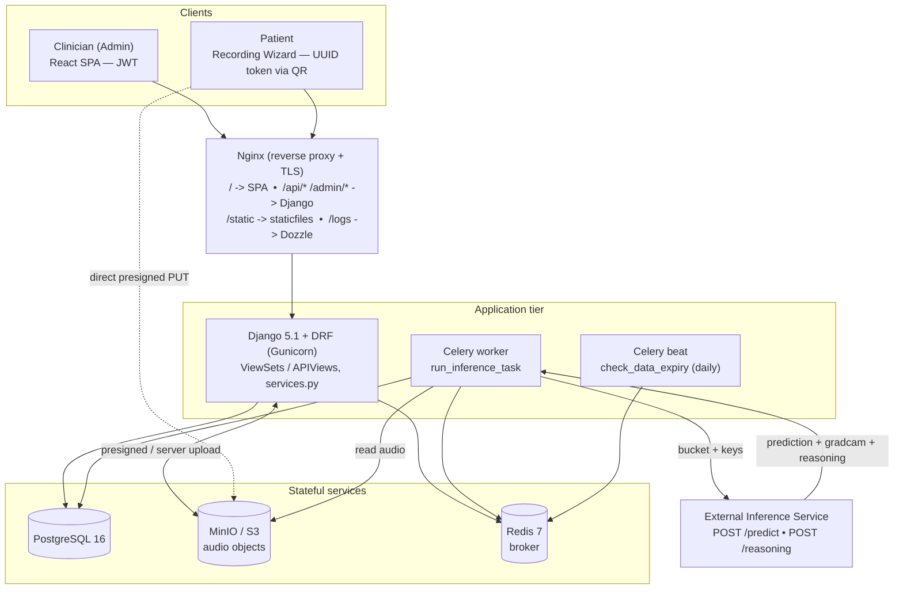
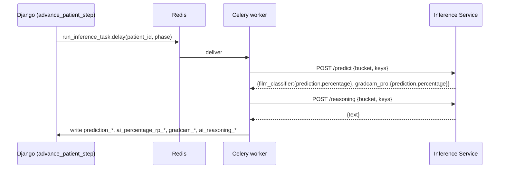

# RecurrSens — Codebase Knowledge (Master Brain-Dump)

> Single, self-contained reference for implementing features, fixing bugs, and refactoring
> **RecurrSens** safely. Written against branch `dev/create-centers`.
>
> Audience: an engineer or LLM with **no prior repo access**. Every claim is tied to a file,
> class, function, or feature. File references are relative paths from the repo root.
>
> Companion diagrams live in [`assets/`](assets/): `architecture.mmd`, `er-diagram.mmd`,
> `state-machine.mmd`, `inference-sequence.mmd` (also embedded inline below).

---

## Table of Contents

1. [High-Level Overview](#1-high-level-overview)
2. [System Architecture](#2-system-architecture)
3. [Feature-by-Feature Analysis](#3-feature-by-feature-analysis)
4. [Things You Must Know Before Changing Code](#4-things-you-must-know-before-changing-code)
5. [Technical Reference & Glossary](#5-technical-reference--glossary)
6. [Assumptions & Open Questions](#6-assumptions--open-questions)

---

## 1. High-Level Overview

### 1.1 What it is

RecurrSens is a **medical platform for diagnosing vocal-cord lesions** caused by **recurrent
laryngeal nerve paresis (RP — German: *Recurrensparese*)**. The clinical idea: a patient's voice
is recorded performing standardized vocal exercises **before** and **after** surgery; an AI model
analyzes the audio to predict whether the recurrent laryngeal nerve is impaired, with a confidence
percentage and a Grad-CAM explainability overlay plus a natural-language reasoning text.

The product is bilingual-leaning but the **UI and admin are in German** (`LANGUAGE_CODE = 'de-de'`,
`TIME_ZONE = 'Europe/Berlin'`).

### 1.2 Target users

| User | How they access | Auth |
|---|---|---|
| **Clinician / Admin** | React dashboard SPA | SimpleJWT (username/password) |
| **Patient** | Guided recording wizard opened from a **QR code** | The patient's **UUID primary key** used as a bearer-in-URL token — no account |
| **Super Admin** | Same dashboard, elevated role | JWT with `role = SUPER_ADMIN` |
| **Center User** | Same dashboard, scoped to one clinic | JWT with `role = CENTER_USER` |

### 1.3 Feature catalog (with business purpose)

| Feature | Business need it fills | Primary code |
|---|---|---|
| **Patient lifecycle management** | Clinicians register pseudonymous patients and drive them through a controlled pre-op → post-op journey | `PatientViewSet`, `services.advance_patient_step` |
| **Guided recording wizard** | Patients self-record standardized exercises without staff, via QR — scalable data capture | `frontend/src/pages/PatientWizardPage.tsx`, `components/wizard/*`, `hooks/useExerciseSession.ts` |
| **Async AI inference** | Turn raw audio into a clinical signal (RP / healthy + % + Grad-CAM + reasoning) without blocking the request | `tasks.run_inference_task` + external inference service |
| **Multi-center isolation** | Multiple clinics share one deployment but each only sees its own patients | `Center`, `UserProfile`, queryset scoping in `PatientViewSet` |
| **Data retention & soft-delete** | Comply with medical data-minimization: auto-expire and purge audio after a retention window, but only once safely exported | `Patient.expires_at/last_exported_at/deleted_at`, `tasks.check_data_expiry`, `services.delete_patient_with_files` |
| **Export (CSV + audio ZIP)** | Researchers/clinicians extract a dataset for offline analysis | `ExportView`, `services.export_patients_zip` |
| **PDF + QR generation** | Hand the patient a printable sheet linking to their wizard | `services.generate_patient_pdf` |
| **Audio management & reassignment** | Fix mis-filed recordings (wrong phase/session) without re-recording | `AudioFileReassignView`, `services.move_audio_in_s3` |
| **Feedback & exercise skips** | Capture patient UX signal and tolerate exercises a patient cannot perform | `PatientFeedbackView`, `ExerciseSkipView` |

### 1.4 How the features interact (narrative)

A clinician logs in (JWT) and **creates a Patient** (a pseudonymous `patient_id`, auto-assigned to
the clinician's `Center`). They print/share the **PDF/QR** or copy the link `/p/{uuid}`. The patient
opens the **wizard**, grants microphone access, and records each **Exercise**; recordings upload to
**MinIO/S3** and are grouped into a **RecordingSession**. When the patient finishes a phase, the
status machine **advances**, which (a) for `PRE_OP_DONE`/`POST_OP_DONE` fires the **inference**
Celery task that writes predictions back onto the `Patient`, and (b) auto-creates the next session
where relevant. The clinician monitors progress and predictions in the **dashboard**, can **reassign**
audio, **export** the patient as CSV+ZIP, and the daily **retention** task warns about and then
**soft-deletes** expired patients that have already been exported.

---

## 2. System Architecture

### 2.1 Tech stack

| Layer | Choice |
|---|---|
| Frontend | React 19, Vite 8, TypeScript 5.9, Mantine 7, Tailwind CSS v4, Motion (Framer), React Router 7, Axios |
| Backend | Django 5.1, DRF 3.15, SimpleJWT 5.3, Python 3.12 |
| Database | PostgreSQL 16 |
| Object storage | MinIO (dev) / AWS S3 (prod) via `django-storages[s3]` + boto3 |
| Task queue | Celery 5 (+ `django-celery-results`, `django-celery-beat`) + Redis 7 |
| PDF/QR | reportlab + qrcode |
| Infra | Docker Compose, Nginx, Gunicorn, Let's Encrypt, GitHub Actions, Dozzle (log viewer) |

Backend deps: `backend/requirements.txt`. Frontend deps: `frontend/package.json`.

### 2.2 Component map & data flow

Request flow:
- **SPA + API**: Browser → Nginx. `/api/*` and `/admin/*` proxy to Django (Gunicorn :8000);
  everything else serves the React build with SPA fallback (`try_files $uri $uri/ /index.html`).
  See `nginx/default.conf`.
- **Audio upload (two strategies)**: (1) **server-side** multipart to `/api/p/{token}/audio/upload/`
  (Django streams to S3); (2) **presigned** — client asks `/audio/presign/`, PUTs directly to S3,
  then calls `/audio/confirm/`. Frontend currently uses the server-side path (`uploadAudio` in
  `frontend/src/api/client.ts`); presign/confirm endpoints exist for direct-to-storage uploads.
- **Inference**: Django enqueues a Celery task on Redis; worker reads audio keys, calls the external
  inference HTTP service, writes results back to Postgres.

### 2.3 Cross-cutting concerns

- **Dual authentication**
  - *Admins*: SimpleJWT. Tokens are minted by a **custom** serializer
    `CenterTokenObtainPairSerializer` (`backend/patients/token.py`) that injects `role` and
    `center_id` claims so the SPA can decode them client-side without an extra request. Access token
    lifetime 2h, refresh 7d, rotation + blacklist enabled (`config/settings/base.py`).
  - *Patients*: the `Patient.id` **UUID is the token**, passed in the URL (`/api/p/{token}/...`).
    Validated by `IsPatientTokenValid` (`backend/patients/permissions.py`).
  - *Hybrid*: `IsAdminOrPatientToken` allows audio endpoints to accept either.
- **Authorization / multi-tenancy**: `PatientViewSet.get_queryset()` filters to the requester's
  `Center` when `role == CENTER_USER`; `SUPER_ADMIN` sees all. Delete and export require
  `IsSuperAdmin`.
- **CORS / CSRF**: `corsheaders` with `CORS_ALLOWED_ORIGINS` (dev allows all); `CSRF_TRUSTED_ORIGINS`
  from env. `CORS_EXPOSE_HEADERS = ['X-Export-Filename']` so the SPA can read the export filename.
- **Storage**: `django-storages` S3Boto3 with path-style addressing (MinIO-compatible). Helpers in
  `services.py` (`get_s3_client`, presigned URL generators, upload/delete/move/get).
- **Async / scheduling**: Celery app in `backend/config/celery.py`; beat schedule in settings runs
  `check_data_expiry` daily. Result backend = `django-db`.
- **Split settings**: `config/settings/base.py` → `development.py` / `production.py`, selected by
  `DJANGO_SETTINGS_MODULE`. Production adds HSTS, secure cookies, `X-Frame-Options: DENY`,
  `SECURE_PROXY_SSL_HEADER`, `USE_X_FORWARDED_HOST`.
- **Logging**: console handlers; dev INFO, prod WARNING (INFO for `patients`).

### 2.4 Deployment topology

- **Compose files**: `docker-compose.yml` (base: db, minio, redis, backend, celery, celery-beat,
  nginx), `docker-compose.dev.yml` (bind mounts, `runserver`, nginx disabled via profile),
  `docker-compose.prod.yml` (RAM limits for a 1 vCPU / ~856MB Strato VPS + 2GB swap; Gunicorn 1
  worker; Celery `--concurrency=1`; Dozzle log viewer at `/logs/`),
  `docker-compose.staging.yml` (separate DB/bucket/Redis-DB, shares infra network, nginx on :8080).
- **Images**: `backend/Dockerfile` (multi-stage, non-root `django` user, `entrypoint.sh`),
  `nginx/Dockerfile` (multi-stage: `node` builds the SPA → `nginx:alpine` serves it).
- **`backend/entrypoint.sh`**: `migrate` → `loaddata exercises` (seed exercises) → create superuser
  from `DJANGO_SUPERUSER_*` → `collectstatic` → exec Gunicorn.
- **CI/CD** (`.github/workflows/`): `ci.yml` runs Django tests on `dev/**` and PRs to `main`;
  `deploy.yml` tests → builds images to GHCR → SSH deploys (`git pull && docker compose pull && up -d`).
- **TLS**: Let's Encrypt / Certbot (webroot via `/.well-known/acme-challenge/`), auto-renew by host
  systemd timer. Nginx enforces HTTPS, `client_max_body_size 50M`, 120s proxy read timeout.

Service URL map (`docs/endpoints.md`): dev frontend `localhost:5173`, API `localhost:8000/api/`,
admin `localhost:8000/admin/`, MinIO console `localhost:9001`; prod everything under
`https://recurrsens.eu` with logs at `/logs/`.

---

## 3. Feature-by-Feature Analysis

For each feature: **purpose → entry points → controllers/services → models → side effects →
interactions → edge cases.**

### 3.1 Admin authentication & identity

- **Purpose**: authenticate clinicians; tell the SPA who they are and which center they belong to.
- **Entry points**: `POST /api/auth/token/` (login), `POST /api/auth/token/refresh/`,
  `GET /api/me/`. Frontend: `frontend/src/pages/LoginPage.tsx`, `api/client.ts` (`login`, token
  interceptors, `getMe`).
- **Controllers**: `CenterTokenObtainPairView` (`token.py`) returns access+refresh with custom
  `role`/`center_id` claims; `MeView` returns `{username, role, center_id, center_name}`.
- **Side effects**: SPA stores `access_token`/`refresh_token` in `localStorage`; Axios request
  interceptor attaches `Authorization: Bearer`; response interceptor auto-refreshes on 401 once,
  else clears tokens.
- **Interactions**: role/center gate the patient list, delete, export, and the sidebar/topbar labels.
- **Edge cases / branch note**: on `dev/create-centers` the frontend's `getMe`/`getUserRole`/
  `isSuperAdmin` helpers and `MeResponse`/`UserRole` types were **removed** from `client.ts` even
  though the backend `/api/me/` and JWT claims still exist — see §4 and §6.

### 3.2 Patient CRUD & center scoping

- **Purpose**: manage pseudonymous patient records.
- **Entry points** (JWT, `backend/patients/urls.py`):
  - `GET/POST /api/patients/` (list/create), `GET/PATCH/DELETE /api/patients/{token}/`
  - Custom actions: `POST .../advance/`, `GET .../completeness/`, `GET .../pdf/`,
    `POST .../sessions/`.
- **Controller**: `PatientViewSet` (`views.py`). Serializer per action: `PatientListSerializer`
  (dashboard, includes computed `audio_count_pre/post`, `current_post_op_session_number`),
  `PatientCreateSerializer`, `PatientUpdateSerializer`, `PatientDetailSerializer` (nested audio +
  sessions). Queryset scoped to center for `CENTER_USER`.
- **Models**: `Patient` (UUID PK). `center` FK auto-set on create from the requester's profile.
- **Frontend**: `DashboardPage.tsx` (KPI cards + `PatientList`), `PatientDetailsPage.tsx`,
  `CreatePatientDialog.tsx`, `PatientAccessOptions.tsx`. API fns: `getPatients`, `getPatient`,
  `createPatient`, `updatePatient`, `deletePatient`.
- **Edge cases**: `patient_id` is unique and required; delete is **soft** (see §3.7); the
  `start_post_op` create flag exists in `PatientCreateSerializer` but the frontend checkbox was
  removed on this branch (patients always start `NEW`/PRE-OP from the UI).

### 3.3 Patient workflow state machine

- **Purpose**: enforce a controlled, one-way clinical journey and trigger side effects at the right
  transitions.
- **States** (`Patient.Status`): `NEW → CONSENT_GIVEN → PRE_OP_DONE → POST_OP_STARTED → POST_OP_DONE`.
  (`COMPLETED`/`EXPIRED` were removed in migration `0004`.)

```mermaid
stateDiagram-v2
    [*] --> NEW: createPatient
    NEW --> CONSENT_GIVEN: advance (auto-create first PRE_OP session)
    CONSENT_GIVEN --> PRE_OP_DONE: advance (set pre_op_date; inference PRE_OP)
    PRE_OP_DONE --> POST_OP_STARTED: advance (admin unlocks post-surgery)
    POST_OP_STARTED --> POST_OP_DONE: advance (set post_op_date; inference POST_OP)
    POST_OP_DONE --> [*]
```

- **Core logic**: `services.advance_patient_step(patient)` + the `STATUS_TRANSITIONS` dict
  (`services.py`). It sets `pre_op_date`/`post_op_date` on the right transitions, **auto-creates the
  first PRE_OP `RecordingSession`** when entering `CONSENT_GIVEN`, and **enqueues
  `run_inference_task`** when entering `PRE_OP_DONE` or `POST_OP_DONE`. Invalid transitions raise
  `ValueError`.
- **Variant**: `services.init_post_op_patient(patient)` starts a patient directly at
  `POST_OP_STARTED` (post-surgery first visit), setting `post_op_date` and creating a POST_OP session.
- **Entry points**: admin `POST /api/patients/{token}/advance/`; patient-facing
  `POST /api/p/{token}/advance/` (`PatientPublicAdvanceView`). Frontend: `advancePatient` (admin
  "unlock post-op"), `advancePublicPatient` (wizard).
- **Edge cases**: no rollback path; advancing has irreversible side effects (dates, sessions,
  inference). **Never set `Patient.status` directly** (CLAUDE.md rule).

### 3.4 Guided recording wizard (patient-facing)

- **Purpose**: let patients self-record standardized exercises with quality gating, no login.
- **Entry**: route `/p/:token` → `frontend/src/pages/PatientWizardPage.tsx` (uses `publicApi`, no
  JWT). Initial load: `getPublicPatient(token)` → `PatientPublicSerializer` (status, completed/
  skipped exercise ids per phase, feedback flags, current post-op session number — **no AI fields**).
- **Screen flow** (`components/wizard/`, animated with Motion `AnimatePresence`):
  1. `LandingScreen` — mic permission + `advancePublicPatient` (→ `CONSENT_GIVEN`); passes the
     `MediaStream` down so it is reused across phases.
  2. `RecordingScreen` — exercise loop driven by `hooks/useExerciseSession.ts`.
  3. `FeedbackScreen` — 1–5 rating + optional comment.
  4. `WaitingScreen` — after `PRE_OP_DONE` ("wait for surgery").
  5. `CompletedScreen` — after `POST_OP_DONE`.
- **Recording mechanics**: `AudioRecorder.tsx` (hold-to-record via pointer events, `MediaRecorder`
  with best available mime `webm/opus → webm → mp4`), `AudioVisualizer.tsx` (Web Audio
  `AnalyserNode` + canvas). Auto-stops if the tab is hidden/loses focus.
- **Quality gating** (`useExerciseSession.handleRecordingComplete`): RMS dBFS window
  (`MIN_DBFS = -30`, `MAX_DBFS = -6`) and per-exercise minimum duration (e.g. `happy_birthday` 6s,
  others 2s). After 2 quality failures a **Skip** option appears → `skipExercise` →
  `POST /api/p/{token}/skips/` (`ExerciseSkipView`). Utilities: `frontend/src/utils.ts`
  (`getAudioDuration`, `calculateRMS`).
- **Upload**: `uploadAudio(token, blob, exerciseId)` → `POST /api/p/{token}/audio/upload/`
  (`AudioUploadView`). On the **last** exercise the hook calls `advancePublicPatient`. Exercises come
  from `getExercises()` → `GET /api/exercises/` (`ExerciseListView`, active only, public).
- **Feedback**: `submitFeedback` → `PatientFeedbackView` upsert (unique per patient+phase). Comment
  textarea surfaces when rating ≤ 3.
- **Interactions / edge cases**: completeness for advancing relies on each active exercise having an
  audio **or** a skip per phase (`services.check_completeness`). Sessions scope which recordings
  count (post-op follow-ups have `session_number ≥ 2`).

### 3.5 AI inference

- **Purpose**: convert recorded audio into a clinical prediction + explainability.
- **Trigger**: `advance_patient_step` calls `run_inference_task.delay(str(patient.id), phase)` on
  `PRE_OP_DONE` / `POST_OP_DONE`.
- **Task**: `tasks.run_inference_task` — `@shared_task(bind=True, max_retries=3,
  default_retry_delay=30)`, 120s per HTTP call.

- **Contract**:
  - Request payload `{ "bucket": <S3_BUCKET>, "keys": [<AudioFile.storage_key>, ...] }` (audio keys
    for that phase).
  - `POST /predict` → `{ film_classifier: {prediction, percentage}, gradcam_pro: {prediction,
    percentage} }`.
  - `POST /reasoning` → `{ text }`.
- **Write-back** (per phase suffix `_pre`/`_post`): `prediction_*`, `ai_percentage_rp_*`,
  `gradcam_prediction_*`, `gradcam_percentage_*`, `ai_reasoning_*`. Saves only changed fields.
- **Config**: `INFERENCE_SERVICE_URL` (default `http://localhost:8001`).
- **Edge cases**: retries on `requests.RequestException` (3×, 30s). Predictions stay `TODO` until the
  task completes; the dashboard shows "Ausstehend…".

### 3.6 Audio storage & management

- **Purpose**: store, stream, download, and correct audio recordings.
- **Storage keys**: session-aware pattern
  `{patient_uuid}/{phase_folder}_{session_number}/{exercise_id}.{ext}` (legacy non-session form
  `{patient_uuid}/{phase_folder}/{exercise_id}.{ext}`). Uploading a new take for the same
  exercise/phase deletes the previous object.
- **Endpoints**: `audio/upload` (server), `audio/presign` + `audio/confirm` (direct-to-S3),
  `GET /api/audio/{id}/` (`AudioStreamView`, `AllowAny`, streams bytes),
  `GET /api/audio/{id}/url/` (`AudioDownloadUrlView`, JWT, presigned 1h),
  `PATCH /api/audio/{id}/reassign/` (`AudioFileReassignView`, JWT).
- **Services**: `get_s3_client`, `generate_presigned_upload_url`, `generate_presigned_download_url`,
  `upload_audio_to_s3`, `delete_audio_from_s3`, `move_audio_in_s3` (copy+delete, used by reassign),
  `get_audio_from_s3`.
- **Validation**: `backend/patients/audio_validation.py` — extension + MIME whitelist + magic-byte
  detection; **50 MB** cap. Frontend mirror: `ALLOWED_AUDIO_EXTENSIONS`/`AUDIO_ACCEPT_ATTR` in
  `client.ts`.
- **Frontend**: `PatientDetailsPage.tsx` audio sections (grouped playback, manual upload modal,
  `BulkReassignDialog` to move between phases / create a follow-up session). `getAudioStreamUrl(id)`
  feeds `<audio src>`; `reassignAudioFile`.
- **Edge cases**: reassign validates the target phase/session belongs to the same patient and only
  performs an S3 move if the derived key changed; DB update is atomic.

### 3.7 Data retention, soft-delete & expiry

- **Purpose**: data minimization — automatically warn about and purge audio once it is past
  retention **and** has been exported.
- **Fields** (`Patient`): `expires_at` (auto-set on `save()` to `now + DATA_RETENTION_DAYS`),
  `notification_sent_at`, `last_exported_at` (set by export), `deleted_at` (soft-delete marker).
  Properties: `is_expiring_soon` (≤24h), `is_deleted`, `has_been_downloaded`.
- **Task**: `tasks.check_data_expiry` (daily via beat) — Pass 1 notifies patients expiring within 24h
  (email is a TODO) and stamps `notification_sent_at`; Pass 2 soft-deletes patients that are expired
  **and** have `last_exported_at` set, via `services.delete_patient_with_files`.
- **Soft delete**: `delete_patient_with_files` removes S3 audio + `AudioFile` rows, clears AI fields,
  sets `deleted_at` — **keeps** `patient_id`, timestamps, session metadata.
- **Frontend**: `AblaufdatenPanel.tsx` + the "Zum Löschen" KPI/`OVERDUE_DELETE` filter on the
  dashboard; expiry coloring in `PatientList.tsx`.
- **Edge case**: a patient that expires but was never exported is **not** auto-deleted (export is the
  gate). `DATA_RETENTION_DAYS` default is 7 in settings but `.env.example` shows 3 for prod.

### 3.8 Export (CSV + audio ZIP)

- **Purpose**: extract a dataset for offline/research use.
- **Entry**: `GET /api/export/?ids=uuid1,uuid2` (`ExportView`, `IsSuperAdmin`). Omitting `ids`
  exports all non-deleted patients.
- **Service**: `services.export_patients_zip(patient_ids=None)` builds a ZIP containing
  `metadata.csv` (one row/patient: PatientenID, Status, Prä-OP/Post-OP dates, audio counts,
  created_at), audio under `{patient_id}/prae_op/` and `{patient_id}/post_op_{n}/`, plus an optional
  `errors.txt` for S3 fetch failures. **Side effect**: stamps `last_exported_at = now()` (which then
  enables retention deletion).
- **Frontend**: `exportPatients(ids?)` reads the filename from the `X-Export-Filename` header and
  triggers a browser download (`DashboardPage` bulk action).

### 3.9 PDF + QR generation

- **Purpose**: printable patient handout linking to the wizard.
- **Entry**: `GET /api/patients/{token}/pdf/` → `services.generate_patient_pdf` (reportlab A4 with a
  QR encoding `{APP_URL}/p/{patient.id}`). Frontend: `downloadPatientPdf`,
  `PatientAccessOptions.tsx`.

### 3.10 Multi-center (Centers) — branch `dev/create-centers`

- **Purpose**: multi-tenant isolation so each clinic only sees its own patients.
- **Models**: `Center` (UUID PK, unique `name`), `UserProfile` (`OneToOne` to auth `User`, `role` ∈
  `SUPER_ADMIN`/`CENTER_USER`, nullable `center` FK), `Patient.center` FK.
- **Auth integration**: `CenterTokenObtainPairSerializer` adds `role`/`center_id` to JWT;
  `permissions._get_role/_get_center` read the profile (defaulting to `SUPER_ADMIN` if no profile).
- **Scoping**: `PatientViewSet.get_queryset` filters by center for `CENTER_USER`; `IsSuperAdmin`
  gates delete/export.
- **Ops**: migrations `0006` (create models + FK) and `0007` (seed default `MRI` center, assign
  legacy patients, create `SUPER_ADMIN` profiles for existing users); management command
  `python manage.py assign_center "<name>" [--all] [--dry-run]`. Docs: `docs/center-management.md`.
- **Branch state / gap**: backend is wired; the **frontend** on this branch has `center` plumbing
  (Patient.center, `centerName` context, sidebar/topbar labels) but **removed** the `getMe`/role
  helpers and has **no center create/select UI yet** (placeholders in `EinstellungenPage.tsx`). See
  §4 and §6.

---

## 4. Things You Must Know Before Changing Code

1. **Never mutate `Patient.status` directly.** Always go through `services.advance_patient_step`
   (or `init_post_op_patient`). Direct mutation skips date-setting, session auto-creation, and
   inference enqueuing. (Reinforced in `.claude/CLAUDE.md`.)
2. **The patient's UUID PK is a bearer credential.** Anyone with `/p/{uuid}` can act as that
   patient. Don't log it, leak it in error messages, or expose AI fields on patient-facing
   serializers (`PatientPublicSerializer` deliberately omits them).
3. **State machine is one-way with side effects.** Advancing is irreversible; `PRE_OP_DONE`/
   `POST_OP_DONE` enqueue inference, and `CONSENT_GIVEN` auto-creates a session. Test transitions
   with this in mind.
4. **Soft-delete, not hard-delete.** `delete_patient_with_files` keeps metadata and only purges
   audio + AI fields; retention auto-delete **requires a prior export** (`last_exported_at`). Export
   therefore has a retention consequence — calling it stamps the deletion gate.
5. **Storage keys are session-scoped.** Use the `{uuid}/{phase}_{n}/{exercise_id}.{ext}` pattern and
   reuse `services.move_audio_in_s3` for any relocation; remember `AudioFile.session` can be null for
   legacy rows.
6. **Two upload paths exist.** Server-side (`/audio/upload`) and presigned (`/audio/presign` +
   `/audio/confirm`). The frontend uses server-side today; keep both in sync if you change the key
   scheme or validation.
7. **Branch divergence on `dev/create-centers`.** Backend `/api/me/` + JWT role/center claims exist,
   but the frontend removed `getMe`/`getUserRole`/`isSuperAdmin` and the `start_post_op` checkbox.
   If you rely on role in the SPA, re-introduce the decode/helper or finish wiring centers.
8. **Locale & limits.** UI/admin are **German**; timezone **Europe/Berlin**; audio upload cap
   **50 MB**; audio formats are magic-byte validated server-side (`audio_validation.py`).
9. **Run `migrate` after model changes** and remember `entrypoint.sh` also runs `loaddata exercises`
   — exercise fixtures are seed data, not user data.
10. **Resource-constrained prod.** 1 Gunicorn worker, Celery concurrency 1, tight RAM limits
    (`docker-compose.prod.yml`). Avoid heavy synchronous work in request handlers; push to Celery.

---

## 5. Technical Reference & Glossary

### 5.1 Glossary

| Term | Meaning |
|---|---|
| **RP / Recurrensparese** | Recurrent laryngeal nerve paresis — the condition being screened. `prediction = INFECTED` ⇒ RP suspected. |
| **Prä-OP / Post-OP** | Pre-operative / post-operative recording phase. |
| **Grad-CAM** | Class-activation explainability returned by the inference service (`gradcam_*` fields). |
| **Zentrum / Center** | A clinic tenant. Patients and users belong to a center. |
| **patient_id (pseudonym)** | Human-facing non-PII identifier. Distinct from the UUID PK (`id`). |
| **Session / RecordingSession** | A grouping of recordings for one visit; post-op follow-ups increment `session_number`. |
| **Token (patient)** | The patient UUID PK used in `/p/{token}` URLs and QR codes. |

### 5.2 Data model

See [`assets/er-diagram.mmd`](assets/er-diagram.mmd). Models live in `backend/patients/models.py`.

- **Center** — `id` (UUID PK), `name` (unique), `created_at`. Relations: `users` (→UserProfile),
  `patients` (→Patient).
- **UserProfile** — `user` (OneToOne→auth User), `role` (`SUPER_ADMIN`|`CENTER_USER`, default
  `SUPER_ADMIN`), `center` (FK, `SET_NULL`, nullable).
- **Exercise** — auto integer PK (`id`), `exercise_id` (unique str), `title`, `description`,
  `example_audio_url`, `order`, `is_active`. Ordered by `order`. (Frontend `Exercise.id` is a number,
  confirming the int PK.)
- **Patient** — `id` (UUID PK = access token), `patient_id` (unique pseudonym), `center` (FK
  nullable), `status` (Status enum), AI fields `prediction_pre/post` (PredictionStatus),
  `ai_percentage_rp_pre/post`, `gradcam_prediction_pre/post`, `gradcam_percentage_pre/post`,
  `ai_reasoning_pre/post`, dates `pre_op_date`/`post_op_date`/`created_at`/`updated_at`/`expires_at`,
  lifecycle `notification_sent_at`/`last_exported_at`/`deleted_at`. Methods: `save()` (auto
  `expires_at`), props `is_expiring_soon`, `is_deleted`, `has_been_downloaded`.
- **RecordingSession** — `id` (UUID), `patient` FK, `phase` (PRE_OP|POST_OP), `session_number`;
  `unique_together (patient, phase, session_number)`.
- **AudioFile** — `id` (UUID), `patient` FK, `session` FK (nullable), `exercise_id`, `phase`,
  `storage_key`, `created_at`.
- **PatientFeedback** — `id` (UUID), `patient` FK, `phase`, `rating` (1–5, nullable), `comment`,
  `skipped`; `unique_together (patient, phase)`.
- **ExerciseSkip** — `id` (UUID), `patient` FK, `session` FK (nullable), `phase`, `exercise_id`;
  `unique_together (patient, session, exercise_id)`.

**Enums**: `Patient.Status` = NEW, CONSENT_GIVEN, PRE_OP_DONE, POST_OP_STARTED, POST_OP_DONE;
`Patient.PredictionStatus` = TODO, INFECTED, HEALTHY; `Phase` = PRE_OP, POST_OP;
`UserProfile.Role` = SUPER_ADMIN, CENTER_USER.

**Migrations** (`backend/patients/migrations/`): `0001` initial; `0002` `last_exported_at`;
`0003` feedback + exercise-skip; `0004` remove COMPLETED/EXPIRED statuses; `0005` add session FK to
ExerciseSkip; `0006` Center + UserProfile + Patient.center; `0007` seed MRI center + assign legacy +
super-admin profiles.

### 5.3 REST endpoint reference

Routing: `backend/config/urls.py` + `backend/patients/urls.py`. Auth legend: **JWT** (admin),
**UUID** (patient token in URL), **Public** (AllowAny), **Super** (SUPER_ADMIN only).

| Method | Path | Auth | Purpose | Code |
|---|---|---|---|---|
| POST | `/api/auth/token/` | Public | Login → access+refresh (role/center claims) | `CenterTokenObtainPairView` |
| POST | `/api/auth/token/refresh/` | Public | Refresh access token | SimpleJWT |
| GET | `/api/me/` | JWT | Current user (role, center) | `MeView` |
| GET/POST | `/api/patients/` | JWT | List / create patients | `PatientViewSet` |
| GET/PATCH/DELETE | `/api/patients/{token}/` | JWT | Detail / update / soft-delete | `PatientViewSet` |
| POST | `/api/patients/{token}/advance/` | JWT | Advance workflow | `PatientViewSet.advance` |
| GET | `/api/patients/{token}/completeness/` | JWT | Completeness check | `PatientViewSet.completeness` |
| GET | `/api/patients/{token}/pdf/` | JWT | QR-code PDF | `PatientViewSet.pdf` |
| POST | `/api/patients/{token}/sessions/` | JWT | Create recording session | `PatientViewSet.sessions` |
| GET/PATCH | `/api/p/{token}/` | UUID | Public patient data / status update | `PatientPublicView` |
| POST | `/api/p/{token}/advance/` | UUID | Patient-driven advance | `PatientPublicAdvanceView` |
| GET/POST | `/api/p/{token}/feedback/` | UUID | Get / upsert feedback | `PatientFeedbackView` |
| POST | `/api/p/{token}/skips/` | UUID | Record skipped exercise | `ExerciseSkipView` |
| POST | `/api/p/{token}/audio/upload/` | JWT or UUID | Server-side audio upload | `AudioUploadView` |
| POST | `/api/p/{token}/audio/presign/` | UUID | Presigned upload URL | `AudioPresignView` |
| POST | `/api/p/{token}/audio/confirm/` | UUID | Confirm presigned upload | `AudioPresignConfirmView` |
| GET | `/api/audio/{id}/` | Public | Stream audio | `AudioStreamView` |
| GET | `/api/audio/{id}/url/` | JWT | Presigned download URL | `AudioDownloadUrlView` |
| PATCH | `/api/audio/{id}/reassign/` | JWT | Reassign phase/session | `AudioFileReassignView` |
| GET | `/api/exercises/` | Public | Active exercises | `ExerciseListView` |
| GET | `/api/export/?ids=` | Super | CSV+ZIP export | `ExportView` |

### 5.4 Key services, tasks, permissions

- **services.py**: `get_s3_client`, `generate_presigned_upload_url`, `generate_presigned_download_url`,
  `upload_audio_to_s3`, `delete_audio_from_s3`, `move_audio_in_s3`, `get_audio_from_s3`,
  `create_recording_session`, `get_active_session`, `advance_patient_step`, `init_post_op_patient`,
  `check_completeness`, `generate_patient_pdf`, `export_patients_zip`, `delete_patient_with_files`.
- **tasks.py**: `run_inference_task` (inference), `check_data_expiry` (retention beat),
  `send_session_email` (TODO/unimplemented).
- **permissions.py**: `IsAdminUser`, `IsSuperAdmin`, `IsPatientTokenValid`, `IsAdminOrPatientToken`
  (+ helpers `_get_role`, `_get_center`).
- **token.py**: `CenterTokenObtainPairSerializer` / `...View`.
- **admin.py**: rich German admin with `soft_delete_patients` and `create_postop_session` actions,
  inlines for audio/sessions, and `Center`/`UserProfile` admin.

### 5.5 Frontend reference

- **Entry/routing**: `main.tsx` (Mantine + Notifications + dark-mode script), `App.tsx`
  (`BrowserRouter`, `AppDataContext`, `ProtectedRoute`). Routes: `/login`, `/p/:token` (public),
  `/`, `/details/:token`, `/analytik`, `/einstellungen` (last two are placeholders).
- **API layer**: `api/client.ts` — `api` (JWT, interceptors, auto-refresh) vs `publicApi` (no auth).
  All admin + public API functions live here.
- **State/hooks**: `context/AppDataContext.tsx` (patients, userRole, centerName, notificationCount);
  `hooks/useExerciseSession.ts` (recording loop, quality gating, upload).
- **Components**: layout `AppShell`/`Sidebar`/`Topbar`; `PatientList` (search/sort/paginate/bulk);
  `Badges` (Status/FollowUp/Prediction); wizard `Landing/Recording/Feedback/Waiting/Completed`;
  `AudioRecorder`/`AudioVisualizer`; `CreatePatientDialog`, `PatientAccessOptions/Dialog`,
  `AblaufdatenPanel`, `ConfirmDialog`, `RightPanel` (present but unused).
- **Types**: `frontend/src/types.ts` mirrors backend serializers (`Patient`, `PatientDetail`,
  `PatientPublic`, `RecordingSession`, `AudioFile`, `Exercise`, `PatientStatus`, `PredictionStatus`).
- **Build/dev**: `vite.config.ts` proxies `/api` → `localhost:8000`; Tailwind v4 via Vite plugin;
  Mantine via PostCSS preset.

### 5.6 Environment variables

From `.env.example` and `config/settings/base.py`:

| Var | Purpose | Default/Example |
|---|---|---|
| `DJANGO_SECRET_KEY` | crypto secret | change-me |
| `DJANGO_SETTINGS_MODULE` | settings profile | `config.settings.development`/`production` |
| `ALLOWED_HOSTS` | CSV hosts | `*` (dev) |
| `DJANGO_SUPERUSER_USERNAME/EMAIL/PASSWORD` | bootstrap admin (entrypoint) | admin / … |
| `DB_NAME/USER/PASSWORD/HOST/PORT` | PostgreSQL | stimmbandlaesion / postgres / db / 5432 |
| `S3_REGION/ACCESS_KEY/SECRET_KEY/ENDPOINT/BUCKET` | object storage | us-east-1 / minioadmin / http://minio:9000 / stimmbandlaesion |
| `CELERY_BROKER_URL` | Redis broker | redis://redis:6379/0 |
| `INFERENCE_SERVICE_URL` | external AI service | http://localhost:8001 |
| `APP_URL` | base URL for QR | https://recurrsens.eu |
| `CORS_ALLOWED_ORIGINS` / `CSRF_TRUSTED_ORIGINS` | CSV origins | localhost:5173,3000 |
| `DATA_RETENTION_DAYS` | days to expiry | 7 (settings) / 3 (prod example) |
| `ADMIN_NOTIFICATION_EMAIL` | expiry warnings | admin@example.com |

---

## 6. Assumptions & Open Questions

This document was synthesized from a deep multi-agent exploration of the repo. The core spine
(`models.py`, `urls.py`, `services.py`, `tasks.py`, `permissions.py`, `requirements.txt`, frontend
`types.ts`) was then **re-read and verified directly**; the items below note the few points worth
keeping in mind.

| # | Item | Confidence | Notes |
|---|---|---|---|
| 1 | **No patient demographics.** `Patient` stores **only** `patient_id` (pseudonym) + voice/AI data — there are **no** `gender`/`birth_date`/`diagnosis` fields. (An earlier exploration pass mistakenly reported them.) Verified against `backend/patients/models.py` (the model docstring states "no demographics"). | Confirmed | Resolved — fields absent. |
| 2 | **Frontend role helpers on this branch.** `getMe`/`getUserRole`/`isSuperAdmin` reported as removed from `frontend/src/api/client.ts` on `dev/create-centers` while backend `/api/me/` + JWT claims remain. | Medium | `git diff main...dev/create-centers -- frontend/src/api/client.ts` |
| 3 | **`DATA_RETENTION_DAYS` default** is `7` (model `save()` fallback, verified). `.env.example` shows `3` for prod. The effective value depends on env/settings. | Confirmed (code), Medium (settings) | `grep -n DATA_RETENTION_DAYS backend/config/settings/base.py .env.example` |
| 4 | **`send_session_email` / patient email** are TODO — no patient email field exists yet (verified in `tasks.py`). | Confirmed | — |
| 5 | **Line numbers** cited from exploration are indicative; symbol names are authoritative. Verified files: models, urls, services, tasks, permissions. | High | Open the named files. |

---

*End of master document. Diagrams: [`assets/architecture.mmd`](assets/architecture.mmd),
[`assets/er-diagram.mmd`](assets/er-diagram.mmd), [`assets/state-machine.mmd`](assets/state-machine.mmd),
[`assets/inference-sequence.mmd`](assets/inference-sequence.mmd).*
