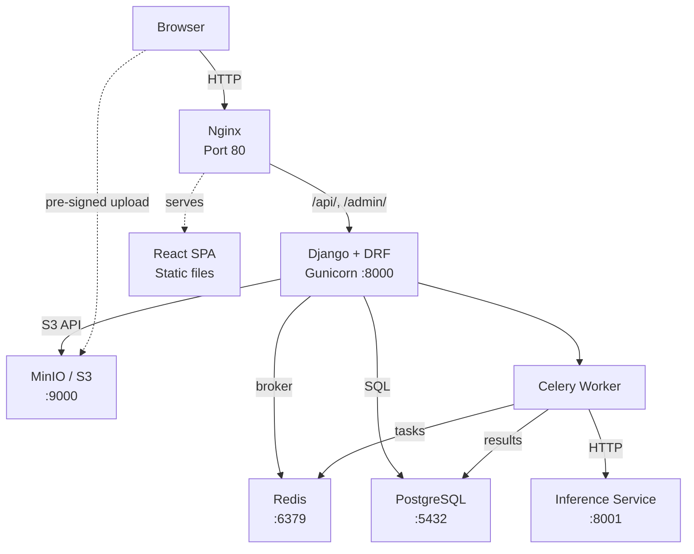
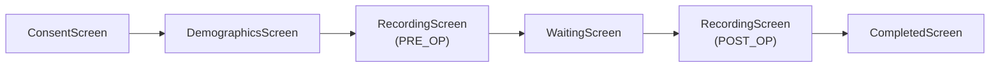

# RecurrSens
## Architecture Documentation

**Date:** April 13, 2026

---

## 1. Introduction

*RecurrSens* is a medical data-collection platform for vocal cord lesion (recurrent laryngeal nerve paresis) diagnosis. It manages patient records, collects voice audio recordings for pre-operative and post-operative phases, integrates an AI inference service for automated prediction, and provides data export functionality for clinical research.

The application follows a containerised microservice architecture orchestrated with Docker Compose, comprising a Django REST back-end, a React single-page application front-end, an Nginx reverse proxy, and supporting infrastructure services (PostgreSQL, MinIO / S3, Redis).

---

## 2. System Overview

The following diagram illustrates the high-level request flow and service topology.

---

## 3. Technology Stack

| Concern | Choice | Rationale |
| :--- | :--- | :--- |
| Back-end framework | Django 5.1 + DRF | Mature ORM, built-in admin, serialisers, permissions |
| Front-end framework | React 19 + Vite 8 | Fast builds, TypeScript, component model |
| UI component library | Material UI (MUI) 7 | Consistent design system, rich widget set |
| Reverse proxy | Nginx | Serves SPA static files, proxies API |
| WSGI server | Gunicorn | Production-grade, multi-worker |
| Database | PostgreSQL 16 | Relational, robust, widely supported |
| Object storage | MinIO (dev) / S3 (prod) | S3-compatible, self-hosted for development |
| Task queue | Celery + Redis | Asynchronous inference calls |
| Authentication | JWT (SimpleJWT) | Stateless admin auth; UUID tokens for patients |
| Containerisation | Docker + Compose | Reproducible, portable deployments |

---

## 4. Infrastructure and Deployment

### 4.1 Docker Compose Services

All services are defined in `docker-compose.yml` with development overrides in `docker-compose.dev.yml`.

| Service | Image | Port(s) | Role |
| :--- | :--- | :--- | :--- |
| `db` | `postgres:16-alpine` | 5432 | Primary relational database |
| `minio` | `minio/minio:latest` | 9000, 9001 | S3-compatible object storage (audio files) |
| `redis` | `redis:7-alpine` | 6379 | Celery message broker |
| `backend` | Custom (Python 3.12) | 8000 | Django application server |
| `celery` | Same as backend | --- | Asynchronous task worker |
| `nginx` | Custom (nginx:alpine) | 80 | Reverse proxy + SPA host |

Three named Docker volumes persist data: `postgres_data`, `minio_data`, and `static_files`.

### 4.2 Nginx Reverse Proxy

Nginx serves four location blocks:

| Location | Target |
| :--- | :--- |
| `/api/*` | Proxy to Django back-end (`backend:8000`) |
| `/admin/*` | Proxy to Django admin interface |
| `/static/*` | Serve Django collected static files |
| `/*` | Serve React SPA with `try_files` fallback to `index.html` |

The maximum client body size is set to 50 MB to accommodate audio file uploads.

### 4.3 Development vs. Production

* **Development:** The back-end uses Django's built-in `runserver` with `DEBUG=True`; source code is bind-mounted for hot-reload. The Nginx container is disabled (profile `production`); the React dev server runs locally on port 5173 with a Vite proxy for `/api` requests.
* **Production:** Gunicorn serves the Django application behind Nginx. The React SPA is built at image-build time and embedded into the Nginx container. Security hardening is enabled (HSTS, secure cookies, `X-Frame-Options: DENY`).

### 4.4 Build Pipeline

Both the back-end and front-end Dockerfiles use multi-stage builds:

1.  **Back-end:** A `python:3.12-slim` builder installs system dependencies and Python packages; the runner stage copies only the installed packages and application code, runs as a non-root `django` user.
2.  **Front-end / Nginx:** A `node:22-alpine` builder produces the Vite production bundle; the final `nginx:alpine` image copies the built `dist/` directory and the Nginx configuration.

On container start-up, the back-end entrypoint script automatically runs database migrations, loads exercise fixture data, creates a default superuser, and collects static files before handing off to Gunicorn.

---

## 5. Back-end Architecture

The Django project follows a split-settings pattern (`config/settings/{base, development, production}.py`) and contains a single application: `patients`.

### 5.1 Data Model

The domain model consists of three entities.

```mermaid
erDiagram
    PATIENT ||--o{ AUDIOFILE : "belongs to (CASCADE)"
    EXERCISE ||--o{ AUDIOFILE : "references"

    EXERCISE {
        char exercise_id PK
        char title
        text description
        char example_audio_url_
        int order
        bool is_active
    }
    PATIENT {
        uuid id PK
        char patient_id UK
        char status
        char gender
        date birth_date
        char diagnosis
        char prediction_pre_post
        float ai_percentage_rp_
        char_or_float gradcam_
        text ai_reasoning_
        datetime created_at
        datetime updated_at
    }
    AUDIOFILE {
        uuid id PK
        uuid patient_id FK
        char exercise_id
        char phase
        char storage_key
        datetime created_at
    }
```

#### 5.1.1 Patient Workflow States

The `Patient.status` field encodes a linear workflow with the following transitions:

`NEW` -> `CONSENT_GIVEN` -> `PRE_OP_DONE` -> `POST_OP_STARTED` -> `POST_OP_DONE`

Each transition is enforced by the `advance_patient_step()` service function, which also records timestamps (`pre_op_date`, `post_op_date`) and triggers asynchronous inference tasks at the appropriate stages.

#### 5.1.2 Enumerations

| Field | Values |
| :--- | :--- |
| `Patient.status` | NEW, CONSENT_GIVEN, PRE_OP_DONE, POST_OP_STARTED, POST_OP_DONE |
| `Patient.gender` | M (male), W (female), D (diverse), ? (unknown) |
| `Patient.diagnosis` | LEFT, RIGHT, BOTH, HEALTHY, TODO |
| `Patient.prediction_*` | TODO, INFECTED, HEALTHY |
| `AudioFile.phase` | PRE_OP, POST_OP |

### 5.2 REST API

The API is built with Django REST Framework and split into three groups based on authentication requirements.

#### 5.2.1 Authentication Endpoints

| Method | URL | Description |
| :--- | :--- | :--- |
| POST | `/api/auth/token/` | Obtain JWT access + refresh token |
| POST | `/api/auth/token/refresh/` | Refresh an expired access token |

Access tokens expire after 2 hours; refresh tokens after 7 days and are rotated and blacklisted upon use.

#### 5.2.2 Admin Endpoints (JWT Required)

| Method | URL | Description |
| :--- | :--- | :--- |
| GET | `/api/patients/` | List all patients (paginated) |
| POST | `/api/patients/` | Create new patient |
| GET | `/api/patients/{id}/` | Retrieve patient details |
| PATCH | `/api/patients/{id}/` | Update patient fields |
| DELETE | `/api/patients/{id}/` | Delete patient and S3 files |
| POST | `/api/patients/{id}/advance/` | Advance workflow step |
| GET | `/api/patients/{id}/completeness/`| Check data completeness |
| GET | `/api/patients/{id}/pdf/` | Download QR-code PDF |
| GET | `/api/export/` | Export CSV + audio ZIP |

#### 5.2.3 Patient-Facing Endpoints (UUID Token)

These endpoints use the patient's UUID primary key as an access token embedded in QR codes, requiring no separate authentication.

| Method | URL | Description |
| :--- | :--- | :--- |
| GET | `/api/p/{token}/` | Get public patient data |
| PATCH | `/api/p/{token}/` | Update demographics |
| POST | `/api/p/{token}/advance/` | Advance workflow step |
| POST | `/api/p/{token}/audio/upload/` | Upload audio file (server-side) |
| POST | `/api/p/{token}/audio/presign/` | Obtain pre-signed upload URL |
| POST | `/api/p/{token}/audio/confirm/` | Confirm pre-signed upload |

#### 5.2.4 Public Endpoints

| Method | URL | Description |
| :--- | :--- | :--- |
| GET | `/api/exercises/` | List active voice exercises |
| GET | `/api/audio/{id}/` | Stream audio file from S3 |
| GET | `/api/audio/{id}/url/` | Pre-signed download URL (JWT) |

### 5.3 Serialisers

DRF serialisers control field exposure and validation:

| Serialiser | Purpose |
| :--- | :--- |
| `PatientListSerializer` | Compact list view with computed `audio_count_pre/post` |
| `PatientDetailSerializer` | Full detail with nested audio files, age computation |
| `PatientPublicSerializer` | Restricted view omitting AI and sensitive fields |
| `PatientCreateSerializer` | Accepts only `patient_id` with uniqueness validation |
| `PatientUpdateSerializer` | Demographics, diagnosis, and AI result fields |
| `ExerciseSerializer` | Read-only exercise metadata |
| `AudioFileSerializer` | Full audio file metadata (admin) |
| `AudioFileCompactSerializer`| Compact audio metadata |
| `CompletenessSerializer` | Boolean `complete`, lists of `missing`/`warnings` |

### 5.4 Permissions

| Class | Logic |
| :--- | :--- |
| `IsAdminUser` | Requires JWT-authenticated user |
| `IsPatientTokenValid` | Validates UUID token in URL maps to existing patient |
| `IsAdminOrPatientToken` | Allows access with either JWT or valid patient token |

### 5.5 Business Logic Services

Domain logic is centralised in `patients/services.py`:

| Function | Description |
| :--- | :--- |
| `advance_patient_step()` | State machine enforcing valid workflow transitions; sets timestamps and triggers inference tasks |
| `check_completeness()` | Validates that all required demographics, diagnosis, and audio files are present |
| `generate_patient_pdf()` | Produces a PDF with a QR code linking to the patient wizard |
| `export_patients_zip()` | Generates a ZIP archive containing a CSV summary and all audio files for completed patients |
| `delete_patient_with_files()`| Deletes S3 objects before cascading the database delete |
| `generate_presigned_upload_url()`| Creates a pre-signed S3 PUT URL for direct client-to-storage uploads |
| `generate_presigned_download_url()`| Creates a pre-signed S3 GET URL |
| `upload_audio_to_s3()` | Server-side upload of audio data to S3 |
| `get_audio_from_s3()` | Downloads audio bytes from S3 |

### 5.6 Asynchronous Tasks

Celery is configured with a Redis broker and `django-db` result back-end. A single shared task is defined:

* **`run_inference_task(patient_id, phase)`**: Calls the external inference service at `/predict` and `/reasoning` endpoints. The payload includes the S3 bucket, audio file keys, patient gender, and age. Results (prediction label, confidence percentage, Grad-CAM outputs, reasoning text) are stored back on the `Patient` model. The task retries up to 3 times with a 30-second delay.

### 5.7 Dependencies

Key Python packages (from `requirements.txt`):
* Django >= 5.1
* djangorestframework >= 3.15
* djangorestframework-simplejwt >= 5.3
* django-cors-headers >= 4.4
* django-filter >= 24.0
* django-storages[s3] >= 1.14
* boto3 >= 1.35
* celery[redis] >= 5.4
* django-celery-results >= 2.5
* gunicorn >= 22.0
* psycopg2-binary >= 2.9
* reportlab >= 4.2
* qrcode[pil] >= 8.0
* requests >= 2.32

---

## 6. Front-end Architecture

The front-end is a React 19 single-page application scaffolded with Vite 8 and written in TypeScript. It uses Material UI (MUI) 7 for the component library and Axios for HTTP communication.

### 6.1 Routing

| Path | Component | Auth | Description |
| :--- | :--- | :--- | :--- |
| `/login` | `LoginPage` | Public | Admin login form |
| `/` | `DashboardPage` | Protected| Patient list, create, export |
| `/details/:token` | `PatientDetailsPage` | Protected| Full patient detail view |
| `/p/:token` | `PatientWizardPage` | Public | Patient-facing data collection wizard |

Protected routes check for a valid JWT in `localStorage` and redirect to `/login` if absent.

### 6.2 API Client

Two Axios instances are configured in `src/api/client.ts`:

* **`api`**: Admin requests with an interceptor that attaches the JWT `Bearer` token and automatically refreshes expired access tokens via the refresh endpoint.
* **`publicApi`**: Unauthenticated requests for the patient-facing wizard flow.

Token lifecycle functions (`setTokens`, `clearTokens`, `isLoggedIn`) use `localStorage` keys `access_token` and `refresh_token`.

### 6.3 Patient Wizard Flow

The patient-facing wizard renders different screen components based on the current `status` value:

| Patient Status | Screen Component |
| :--- | :--- |
| `NEW` | `LandingScreen` |
| `CONSENT_GIVEN` | `RecordingScreen` (phase = PRE_OP) |
| `PRE_OP_DONE` | `WaitingScreen` |
| `POST_OP_STARTED` | `RecordingScreen` (phase = POST_OP) |
| `POST_OP_DONE` | `CompletedScreen` |

### 6.4 Audio Recording

The `AudioRecorder` component uses the browser `MediaRecorder` API to capture voice samples. Key features include:

* Real-time waveform visualisation via the `AudioVisualizer` component.
* Recording timer display.
* Playback of the recorded sample before submission.
* Example audio playback (male/female reference recordings).
* Audio quality validation: RMS level is computed in dBFS via the Web Audio API (`AudioContext`), with acceptance thresholds between -30 dBFS and -6 dBFS.

The `useExerciseSession` hook orchestrates the recording session: it loads the exercise list from the API, manages the current exercise index, and handles sequential upload and workflow advancement.

### 6.5 Component Overview

| Component | Description |
| :--- | :--- |
| `PatientList` | Sortable, filterable MUI data table with search, status / diagnosis / prediction filters |
| `CreatePatientDialog`| Modal dialog to create a new patient record |
| `PatientAccessDialog`| Displays the patient access link and QR code |
| `AudioRecorder` | Audio capture with waveform visualisation and quality checks |
| `AudioVisualizer` | Real-time waveform rendering |
| `ConfirmDialog` | Generic confirmation dialog |
| `StatusBadge` | MUI Chip displaying workflow status with colour coding |
| `DiagnosisBadge` | MUI Chip for diagnosis values |
| `PredictionBadge` | MUI Chip for AI prediction results |

### 6.6 Theme

The application uses a custom MUI theme with primary colour `#1565c0`, secondary colour `#f57c00`, and a light background `#f0f4f8` using the Roboto typeface.

---

## 7. Audio Upload Flow

Two upload strategies are supported to accommodate different deployment scenarios:

1.  **Server-side upload:** The audio blob is sent as `multipart/form-data` to the Django back-end, which writes it to S3/MinIO. This is simpler but routes all data through the application server.
2.  **Pre-signed URL upload:** The client requests a pre-signed S3 PUT URL from the back-end, uploads the file directly to MinIO/S3, and then confirms the upload. This bypasses Django for the actual file transfer, reducing server load.

In both cases, an `AudioFile` database record is created linking the patient, exercise, phase, and S3 storage key.

---

## 8. AI Inference Integration

After the pre-operative (or post-operative) recording phase is completed, the `advance_patient_step()` function dispatches a Celery task (`run_inference_task`) that:

1.  Collects the S3 keys for all audio files of the relevant phase.
2.  Sends a prediction request to the external inference service at `{INFERENCE_SERVICE_URL}/predict` with the audio storage keys, patient gender, and age.
3.  Sends a reasoning request to `/reasoning` for explainability outputs.
4.  Stores the results on the `Patient` model: prediction label (`INFECTED`/`HEALTHY`), confidence percentage, Grad-CAM prediction and percentage, and reasoning text.

The task is configured with automatic retries (up to 3 attempts, 30-second delay) to handle transient inference service failures.

---

## 9. Data Export

The export endpoint (`GET /api/export/`) generates a ZIP archive containing:

* **`export.csv`**: A CSV file with all completed patient records including demographics, diagnosis, AI prediction results, and timestamps.
* **Audio files**: All associated audio recordings downloaded from S3, organised by patient and phase.

This supports offline analysis and integration with external research tools.

---

## 10. Security Considerations

* **Authentication:** Admin routes require JWT tokens (access + refresh). Patient-facing routes are secured by unguessable UUID tokens embedded in QR codes.
* **CORS:** Allowed origins are configurable via environment variables; in production, only the application domain is permitted.
* **Production hardening:** HSTS is enabled, cookies are marked secure and HTTP-only, `X-Frame-Options` is set to `DENY`.
* **SQL injection:** Mitigated by Django ORM parameterised queries.
* **CSRF/XSS:** Django's built-in middleware active; DRF uses session-safe authentication classes.
* **File uploads:** Maximum body size enforced at the Nginx level (50 MB); audio files are stored in isolated S3 buckets, not on the application filesystem.
* **Non-root containers:** The back-end runs as a dedicated `django` user inside the container.

---

## 11. Summary

RecurrSens provides a complete clinical data-collection pipeline: clinicians create patient records via an authenticated dashboard, patients complete a guided wizard to provide demographic information and voice recordings, an AI inference service analyses the recordings asynchronously, and all data can be exported for research purposes. The fully containerised architecture ensures reproducible deployments across development and production environments.
